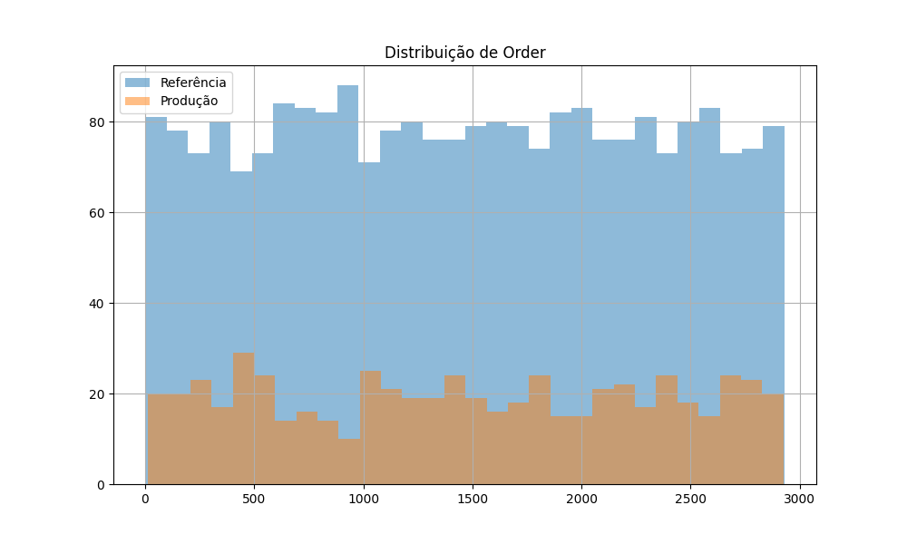
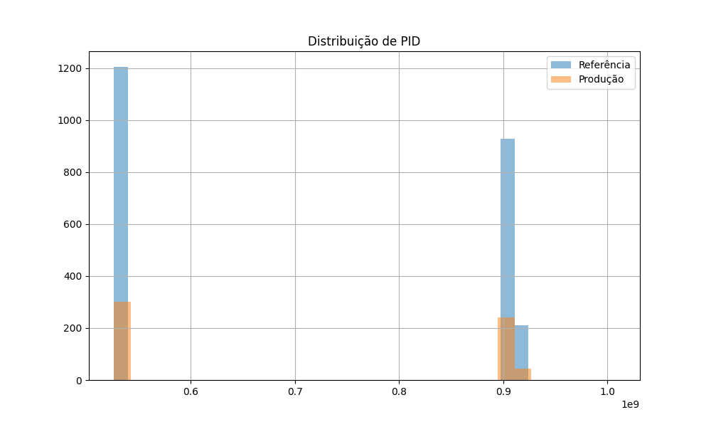
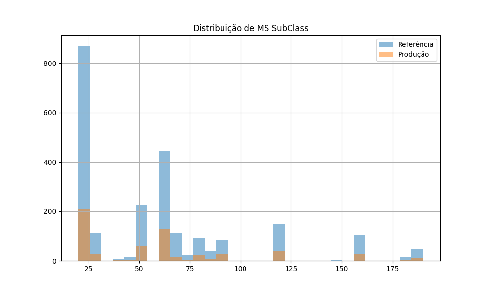
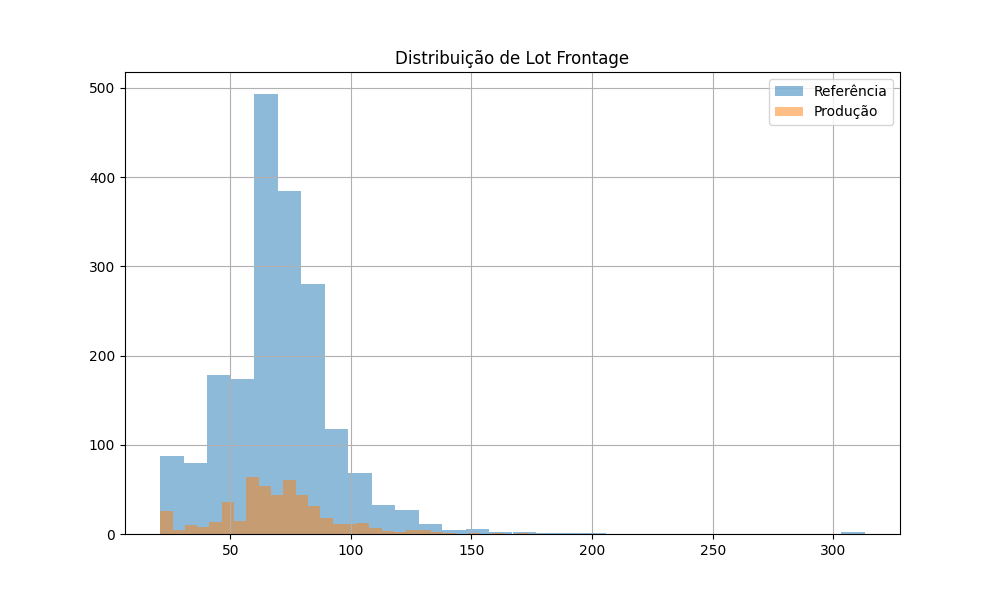
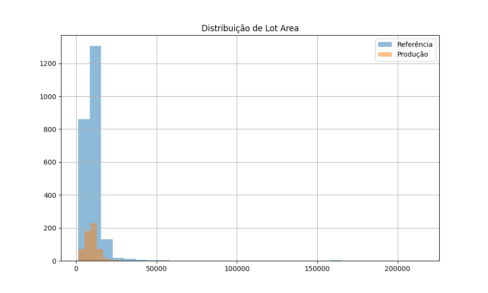
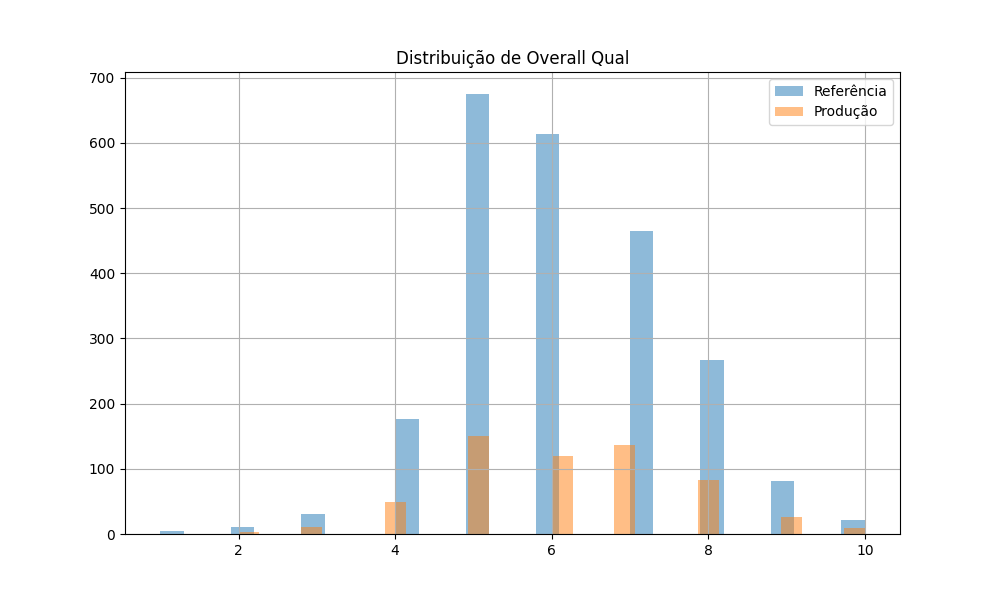
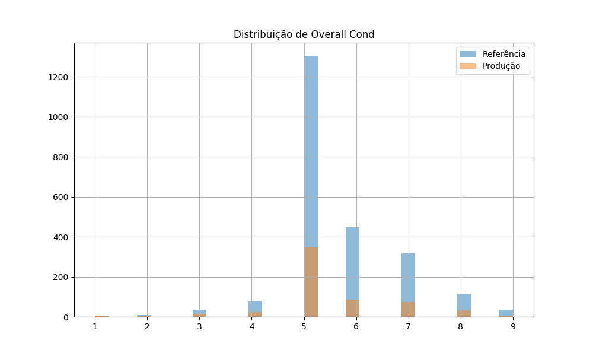
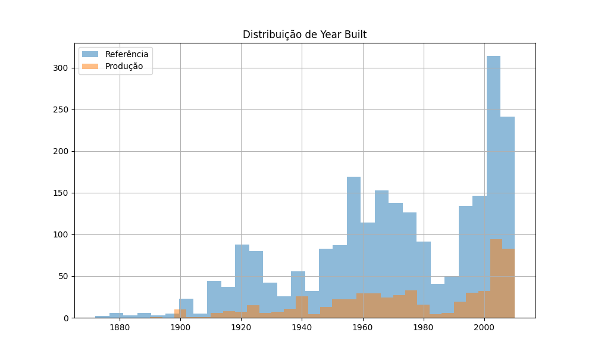

# Relatório de Data Drift

Data de geração: 2025-04-21 21:40:49

## Informações dos Datasets

Dataset de referência: 2344 linhas, 82 colunas

Dataset de produção: 586 linhas, 82 colunas

## Estatísticas Comparativas

### Coluna: Order

|       |   Referência |   Produção |   Diferença |   Diferença % |
|:------|-------------:|-----------:|------------:|--------------:|
| count |     2344     |    586     | -1758       |        -75    |
| mean  |     1464.3   |   1470.31  |     6.00683 |          0.41 |
| std   |      842.982 |    858.491 |    15.5085  |          1.84 |
| min   |        1     |     13     |    12       |       1200    |
| 25%   |      737.75  |    688.5   |   -49.25    |         -6.68 |
| 50%   |     1466     |   1464.5   |    -1.5     |         -0.1  |
| 75%   |     2195.25  |   2224.25  |    29       |          1.32 |
| max   |     2930     |   2925     |    -5       |         -0.17 |

### Coluna: PID

|       |     Referência |      Produção |        Diferença |   Diferença % |
|:------|---------------:|--------------:|-----------------:|--------------:|
| count | 2344           | 586           |  -1758           |        -75    |
| mean  |    7.14363e+08 |   7.1487e+08  | 506647           |          0.07 |
| std   |    1.88691e+08 |   1.89052e+08 | 361517           |          0.19 |
| min   |    5.26301e+08 |   5.26352e+08 |  50990           |          0.01 |
| 25%   |    5.28482e+08 |   5.2843e+08  | -52467.5         |         -0.01 |
| 50%   |    5.35454e+08 |   5.35453e+08 |   -950           |         -0    |
| 75%   |    9.07192e+08 |   9.07125e+08 | -66975           |         -0.01 |
| max   |    9.24152e+08 |   1.0071e+09  |      8.29481e+07 |          8.98 |

### Coluna: MS SubClass

|       |   Referência |   Produção |    Diferença |   Diferença % |
|:------|-------------:|-----------:|-------------:|--------------:|
| count |    2344      |   586      | -1758        |        -75    |
| mean  |      57.308  |    57.7048 |     0.396758 |          0.69 |
| std   |      42.8026 |    42.0081 |    -0.794458 |         -1.86 |
| min   |      20      |    20      |     0        |          0    |
| 25%   |      20      |    20      |     0        |          0    |
| 50%   |      50      |    50      |     0        |          0    |
| 75%   |      70      |    70      |     0        |          0    |
| max   |     190      |   190      |     0        |          0    |

### Coluna: Lot Frontage

|       |   Referência |   Produção |     Diferença |   Diferença % |
|:------|-------------:|-----------:|--------------:|--------------:|
| count |    1951      |   489      | -1462         |        -74.94 |
| mean  |      69.2076 |    69.2924 |     0.0848477 |          0.12 |
| std   |      23.418  |    23.1776 |    -0.240372  |         -1.03 |
| min   |      21      |    21      |     0         |          0    |
| 25%   |      58      |    60      |     2         |          3.45 |
| 50%   |      68      |    69      |     1         |          1.47 |
| 75%   |      80      |    80      |     0         |          0    |
| max   |     313      |   174      |  -139         |        -44.41 |

### Coluna: Lot Area

|       |   Referência |   Produção |   Diferença |   Diferença % |
|:------|-------------:|-----------:|------------:|--------------:|
| count |      2344    |     586    |   -1758     |        -75    |
| mean  |     10127.9  |   10228.2  |     100.322 |          0.99 |
| std   |      8050.91 |    7161.64 |    -889.272 |        -11.05 |
| min   |      1300    |    1484    |     184     |         14.15 |
| 25%   |      7466.5  |    7400.75 |     -65.75  |         -0.88 |
| 50%   |      9356.5  |    9600    |     243.5   |          2.6  |
| 75%   |     11484.2  |   11774.5  |     290.25  |          2.53 |
| max   |    215245    |  115149    | -100096     |        -46.5  |

### Coluna: Overall Qual

|       |   Referência |   Produção |    Diferença |   Diferença % |
|:------|-------------:|-----------:|-------------:|--------------:|
| count |   2344       |  586       | -1758        |        -75    |
| mean  |      6.06442 |    6.21672 |     0.152304 |          2.51 |
| std   |      1.38852 |    1.4927  |     0.104184 |          7.5  |
| min   |      1       |    2       |     1        |        100    |
| 25%   |      5       |    5       |     0        |          0    |
| 50%   |      6       |    6       |     0        |          0    |
| 75%   |      7       |    7       |     0        |          0    |
| max   |     10       |   10       |     0        |          0    |

### Coluna: Overall Cond

|       |   Referência |   Produção |     Diferença |   Diferença % |
|:------|-------------:|-----------:|--------------:|--------------:|
| count |   2344       |  586       | -1758         |        -75    |
| mean  |      5.58191 |    5.48805 |    -0.0938567 |         -1.68 |
| std   |      1.10566 |    1.13259 |     0.0269327 |          2.44 |
| min   |      1       |    1       |     0         |          0    |
| 25%   |      5       |    5       |     0         |          0    |
| 50%   |      5       |    5       |     0         |          0    |
| 75%   |      6       |    6       |     0         |          0    |
| max   |      9       |    9       |     0         |          0    |

### Coluna: Year Built

|       |   Referência |   Produção |    Diferença |   Diferença % |
|:------|-------------:|-----------:|-------------:|--------------:|
| count |    2344      |   586      | -1758        |        -75    |
| mean  |    1970.51   |  1974.75   |     4.24744  |          0.22 |
| std   |      30.3414 |    29.6408 |    -0.700661 |         -2.31 |
| min   |    1872      |  1890      |    18        |          0.96 |
| 25%   |    1953      |  1955      |     2        |          0.1  |
| 50%   |    1972      |  1977      |     5        |          0.25 |
| 75%   |    2000      |  2003      |     3        |          0.15 |
| max   |    2010      |  2010      |     0        |          0    |

### Coluna: Year Remod/Add

|       |   Referência |   Produção |    Diferença |   Diferença % |
|:------|-------------:|-----------:|-------------:|--------------:|
| count |    2344      |   586      | -1758        |        -75    |
| mean  |    1983.92   |  1985.64   |     1.71459  |          0.09 |
| std   |      20.7863 |    21.1159 |     0.329645 |          1.59 |
| min   |    1950      |  1950      |     0        |          0    |
| 25%   |    1965      |  1967      |     2        |          0.1  |
| 50%   |    1992      |  1995      |     3        |          0.15 |
| 75%   |    2003      |  2005      |     2        |          0.1  |
| max   |    2010      |  2010      |     0        |          0    |

